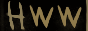

# Vive La Vie Font

## Download [Here](https://heofottoman.github.io/Viva-La-Vie-Font/)

A (poorly-made) font, based on the album covers for the Coldplay album 'Viva La Vida'. This repository contains both the font and source code for it's website.

*yes viva is a typo in some places, I meant vive then*

## Usage
- Download the `ViveLaVie-Regular.otf` or `ViveLaVie-Regular.ttf` files.

Made for Hack Club's [Typeface](https://typeface.hackclub.com) program.

